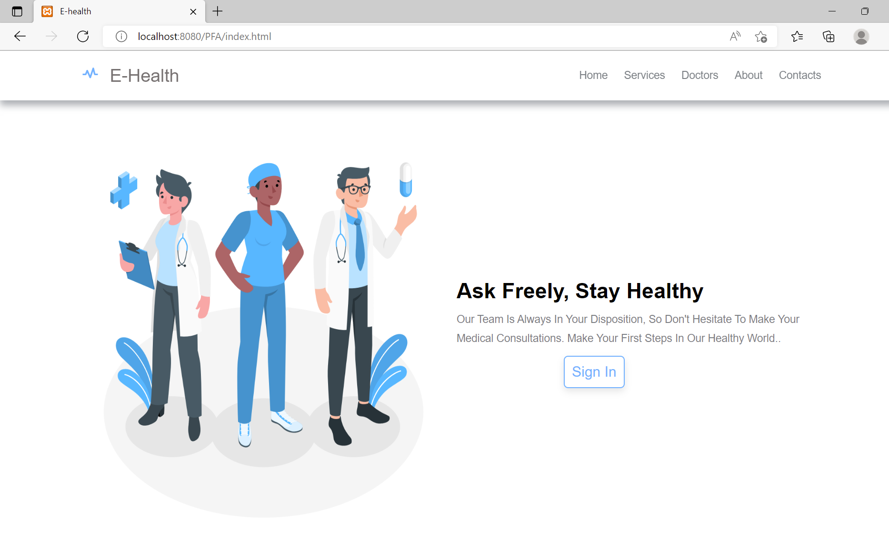
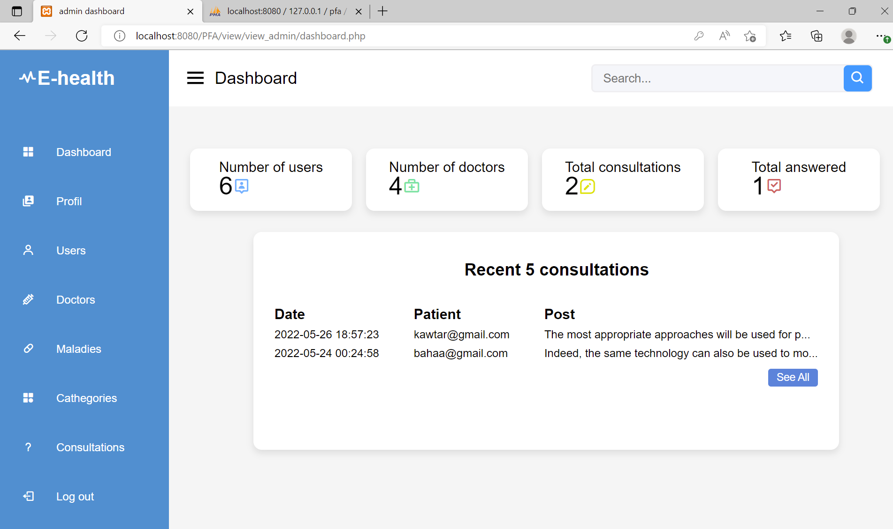
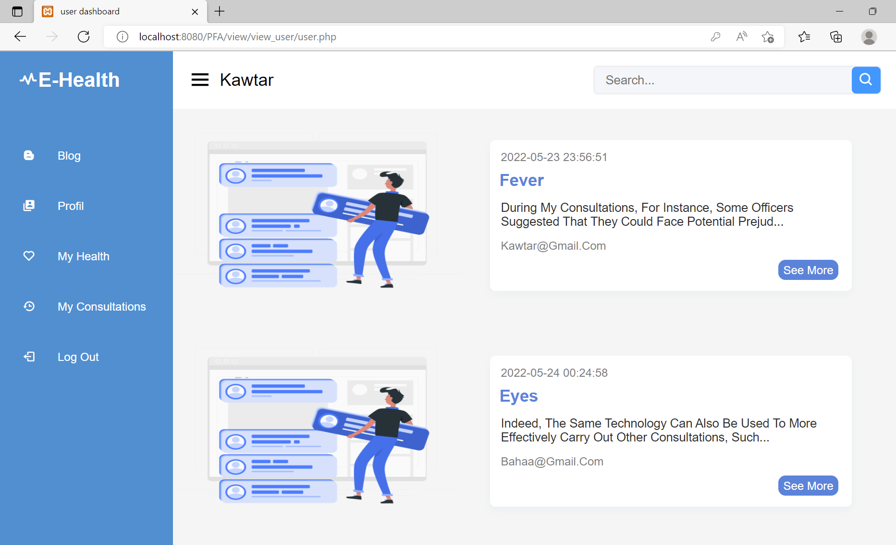
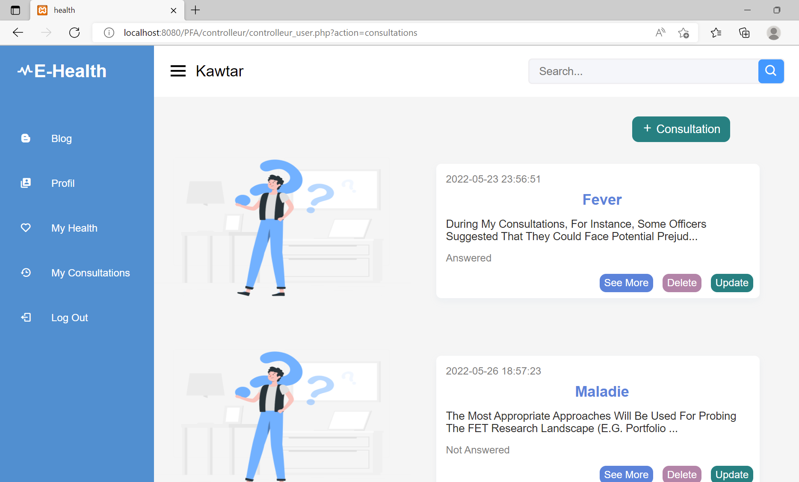

# E-Health-platform
This project addresses the need for enhanced efficiency in the healthcare sector by developing a website to digitize the medical consultation process. Recognizing the challenges of prolonged waiting times and the loss of visit records, our platform aims to streamline services and provide a quick feedback mechanism for patient inquiries without the need for physical presence.

## Table of Contents
* [General Information](#general-information)
* [Technologies Used](#technologies-used)
* [Features](#features)
* [Setup](#setup)
* [Usage](#usage)
* [Screenshots](#screenshots)


## General Information
### Architecture of the project
The Model-View-Controller (MVC) architectural pattern is employed in our project to enhance the organization and maintainability of the codebase. This design pattern divides the application into three interconnected components:

- Model: Represents the data and business logic of the application. It encapsulates the application's state and ensures that any changes to the data trigger appropriate responses.
- View: Responsible for presenting the data to the users. It displays information from the Model and communicates user inputs back to the Controller. Views are designed to be modular and independent of the underlying application logic.
- Controller: Acts as an intermediary between the Model and View components. It processes user input from the View, updates the Model accordingly, and triggers the appropriate changes in the View. The Controller essentially manages the flow of data and ensures the separation of concerns.

### File structure
The file structure of the project is the following:
```
├── controller
|   ├── controlleur_admin.php
|   ├── controlleur_doctor.php
|   └── controlleur_user.php
├── model
|   ├── model_admin.php
|   ├── model_doctor.php
|   └── model_user.php
├── view
|   ├── view_admin
|   ├── view_doctor
|   └── view_user
├── styling.css
├── index.html
├── script.js
├── images.png
└── README.md
```


## Technologies Used
[](https://skillicons.dev)


## Main Features
### Admin Panel:
- Manage patient/doctor accounts.
- Manage diseases/categories defined in the platform.
- Manage consultations.

### Doctor Dashboard:
- View and Respond to different consultations by category.
- View the profile and various diseases of patients who have submitted consultations.
- View the history of consultations they have responded to and modify responses.

### Patient Interface:
- View public questions from other patients and the responses from doctors.
- Add a consultation and track responses.


## Setup
### Pre-Requisites
To set up this project you should install the following:
- XAMPP (apache, mysql)
- VSCODE (or any other IDE)

### Usage
To use the project you should do the following:
- Add the project to **'htdocs'** folder on the xampp environment.
- Create the database on phpmyadmin panel.
  * patients(**`id`**, **`email`**, **`password`**, **`first_name`**, **`last_name`**, **`sexe`**, **`date_of_birth`**)
  * maladies(**`id_maladie`**, **`name_of_maladie`**)
  * cathegories(**`id_cathegory`**, **`name_of_cathegory`**)
  * patient_maladie(**`id_patient`**, **`id_maladie`**)
  * forum(**`id`**, **`Description`**, **`Post`**, **`patient`**, **`id_categorie`**, **`statut`**, **`type`**)
  * answers(**`id_consultation`**, **`id_doctor`**, **`answer`**)
  * admins(**`id_admin`**, **`email`**, **`password`**, **`first_name`**, **`last_name`**)
  * doctors(**`id_doctor`**, **`email`**, **`password`**, **`first_name`**, **`last_name`**, **`sexe`**, **`id_cathegory`**)

## Screenshots
### Home Page

### Admin dashboard 

### Blog page

### Consultations page

